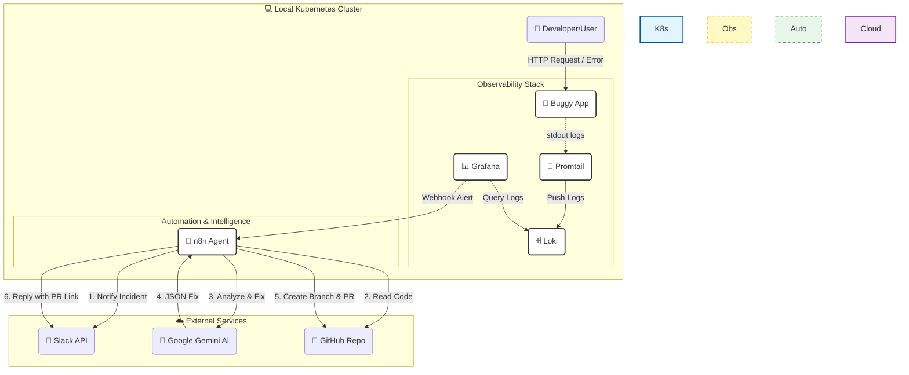

# ATLAS

## Automated Troubleshooting & Log Analysis System


Este proyecto es una Prueba de Concepto (PoC) para demostrar cómo la Inteligencia Artificial puede automatizar la respuesta a incidentes en el desarrollo de software.

## 🎯 Objetivo
Simular un ciclo completo de fallo y recuperación:
1. Una aplicación lanza un error crítico.
2. El sistema de observabilidad lo detecta.
3. Un agente de IA analiza logs + código.
4. Se propone una solución automática en Slack.

## 🛠️ Requisitos Previos
- **Docker** instalado.
- **Kubernetes** local (Minikube, Kind o Docker Desktop).
- **Kubectl** configurado.
- **Helm** instalado.
- **Make** instalado (generalmente viene en Linux/Mac, en Windows usar WSL o Make for Windows).

## 🚀 Guía Rápida (Comandos Make)

Hemos automatizado todo el flujo mediante un `Makefile`. Ejecuta `make help` para ver la lista interactiva o consulta esta tabla:

| Comando | Descripción |
| :--- | :--- |
| `make all` | **Inicio rápido**. Construye la imagen, la carga en el cluster (Minikube/Kind) y despliega la app. |
| `make setup-infra` | Instala el stack de observabilidad (Loki, Promtail, Grafana). Ejecutar una sola vez al inicio. |
| `make tunnel` | Expone la aplicación "Buggy App" en `http://localhost:8080`. |
| `make grafana-tunnel` | Expone Grafana en `http://localhost:3000`. |
| `make grafana-pass` | Muestra la contraseña del usuario `admin` de Grafana. |
| `make logs` | Muestra los logs en vivo de la aplicación para debug rápido. |
| `make clean` | Elimina la aplicación del cluster (útil para reiniciar). |

## 🧪 Cómo ejecutar la Demo

1. **Levantar Infraestructura:**
   ```bash
   make setup-infra

(Esperar unos minutos a que levanten los pods de Loki/Grafana).
1. Desplegar App:

```Bash
make all
```
2. Generar Error:
En una terminal: make tunnel
En el navegador: Ir a http://localhost:8080/critical-feature?id=123 para disparar el error 500.
3. Observar:
Entrar a Grafana con make grafana-tunnel y buscar el log del error.
## 📂 Estructura
/buggy-app: Código fuente de la aplicación Python vulnerable.
Makefile: Orquestador de comandos.

## Arquitectura
